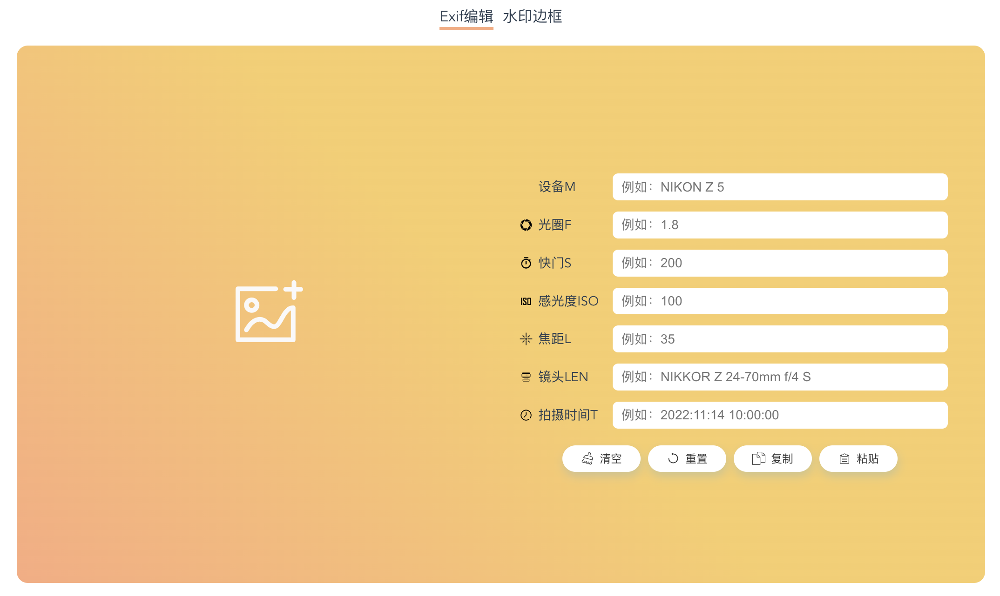
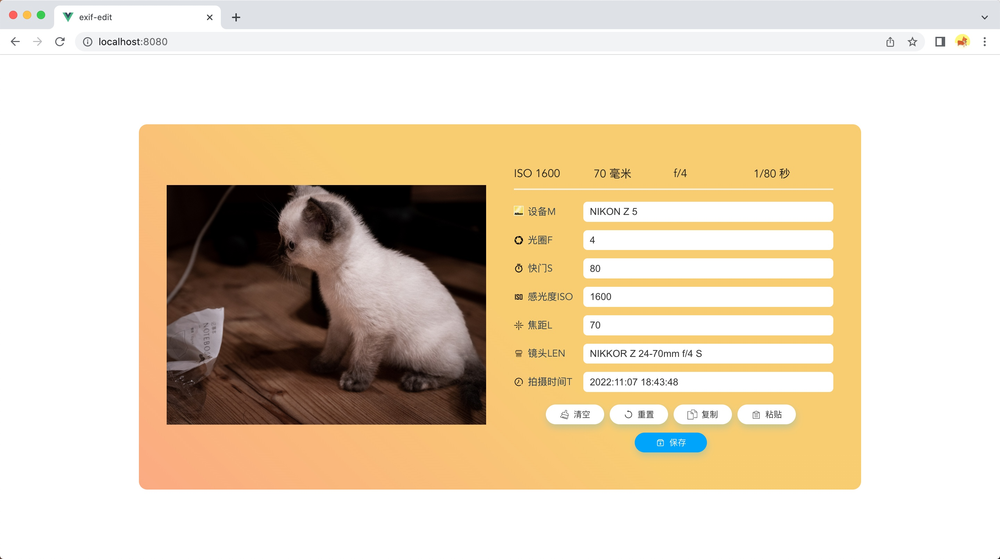
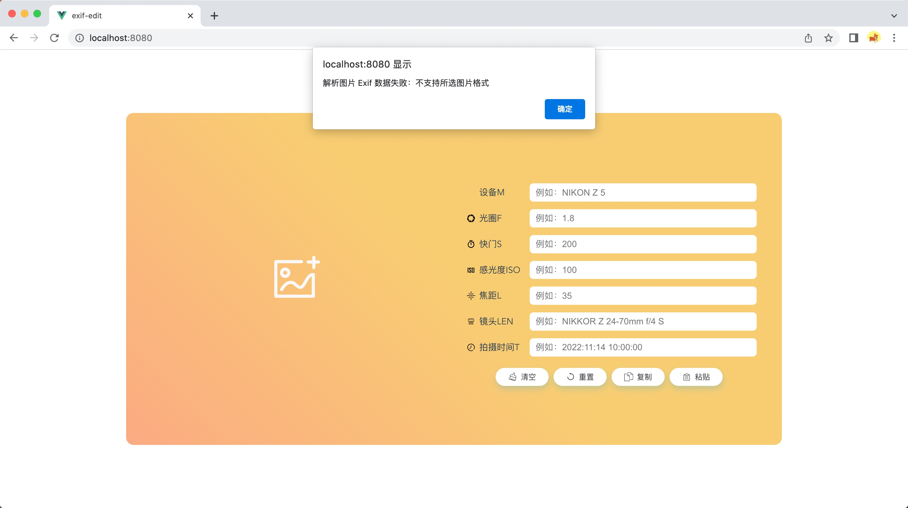
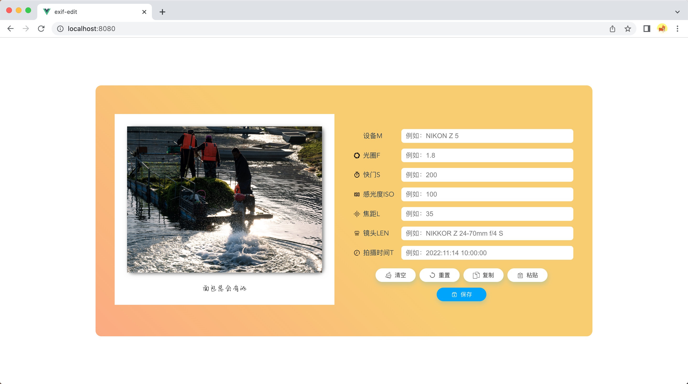

# exif-edit

基于 vue 的图片 exif 元数据编辑、水印边框合成工具应用。

主要功能：

- exif 元数据读写
- 水印边框合成
- 图片排版合成

预览地址：https://exif-edit.vercel.app/

<p align="center">
  
</p>

## 技术框架与核心选型

本项目为纯粹的客户端应用（即无服务端依赖），主要选型如下：

- **Vue 3 + Vite 6**：作为核心架构，替换了早期的 Webpack，提升开发体验与构建热更速度。
- **Tailwind CSS v3**：用于高效编写定制化界面样式。
  > ⚠️ **避坑提醒**：请勿升级至 Tailwind v4。因在特定环境（Windows + Node 22）下，v4 引用的原生 Rust 扩展引擎会引发 Vite 进程发生无报错的永久性死锁挂起。相关调试与排查记录请参见 [构建问题修复记录](./docs/build_hang_issue_record.md)。
- **pnpm**：作为本项目专属的包管理器。
- **图像处理内核**：
  - **piexifjs**：在内存中纯前端化注入、修改图片 EXIF 原始元数据。
  - **Konva.js**：用于多层 Canvas 的控制以及水印排样的高性能重绘合并。

## 安装依赖
```
pnpm install
```

### 开发环境启动
```
pnpm dev
```

### 生产构建
```
pnpm build
```

### 本地预览构建产物
```
pnpm preview
```

## 生产环境启动

### 方式一：Node.js 使用静态资源提供 web 服务

```bash
npm run build:app
cd dist/
npx http-server .
```

### 方式二：Docker 镜像

```bash
npm run build:docker # 构建镜像
docker run -itd --name exif-edit --restart always -p 8080:80 johniexu/exif-edit:latest
```

### 方式三：Docker Compose 一键启动

```bash
docker-compose up -d
```

修改了代码后需要重新构建镜像 `--build`，并且需要先执行完 `npm run build:app`

```bash
docker-compose up -d --build
```
## 线上 Demo 部署

使用 [vercel](https://vercel.com/dashboard) 部署，预览地址：https://exif-edit.vercel.app/

使用 hook 触发部署

> 使用 GET 请求对应的 hook 地址即可触发vercel 自动构建部署

```bash
# 触发 master 分支部署
curl -X GET https://api.vercel.com/v1/integrations/deploy/prj_ZvCedzuUkl1foP4QqcfjfUG1PfkR/qH9ujkhdFR
```

| 分支 | hook |
|-----|-----|
| master | https://api.vercel.com/v1/integrations/deploy/prj_ZvCedzuUkl1foP4QqcfjfUG1PfkR/qH9ujkhdFR |

## 打包发布

### 发布 Docker 镜像

```bash
docker tag johniexu/exif-edit:latest johniexu/exif-edit:latest
docker push johniexu/exif-edit:latest
```

## 效果预览

<p align="center">默认状态</p>


<p align="center">显示 Exif 数据</p>



<p align="center">编辑 Exif 数据</p>


<p align="center">校验不支持格式的图片</p>



<p align="center">校验无 Exif 数据</p>


<p align="center">读取的图片无 Exif 数据</p>


